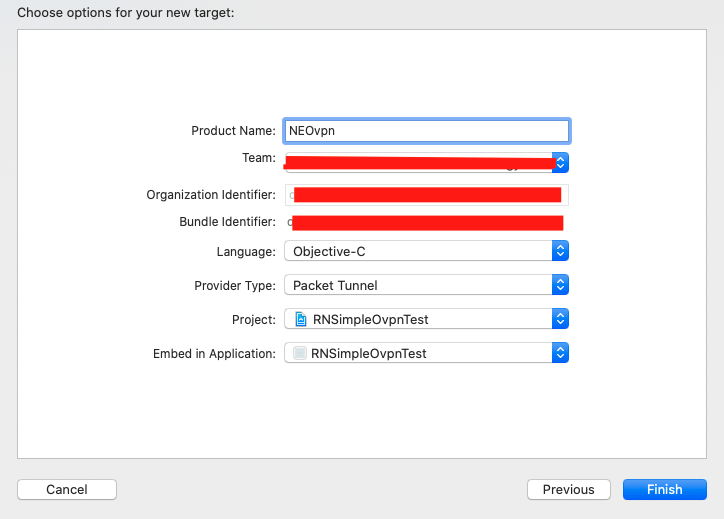
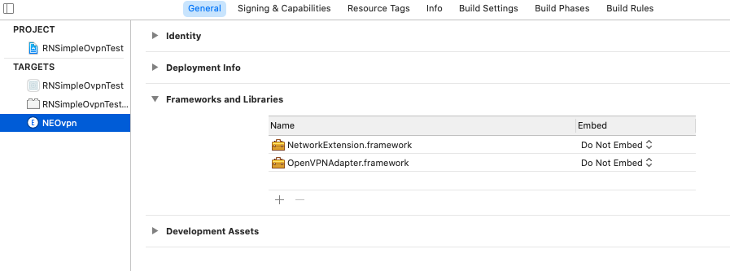
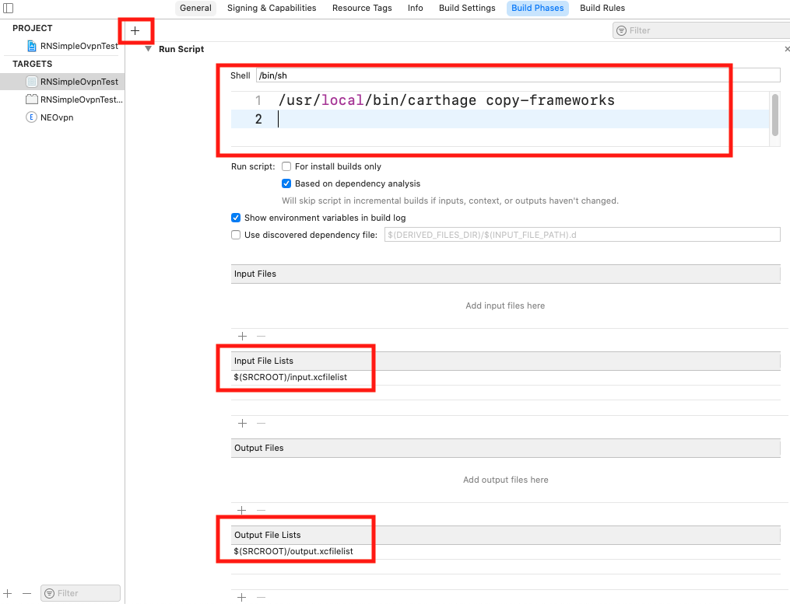

# iOS Guide

English | [简体中文](./iOS-Guide.zh-CN.md)

## Network Extension

### Step 1

Open the iOS project with Xcode and create `Network Extension`: File -> New -> Target -> select it and click Next

Enter the name of the `Network Extension` (e.g. NEOvpn) and refer to the following diagram for other configurations (note that the Team needs to be consistent with the container App)

### Step 2

Open the [Apple Developer](https://developer.apple.com/account/resources) website

> The `group` and `identifier` may have been created automatically when you added the `Network Extension`

- Create `group`：Identifiers -> App Groups -> Click the `+` icon to add
- Network Extension App
  - Create `identifier`
    - Identifiers -> App IDs -> Click the `+` icon to add
    - Enter the bundle identifier of `Network Extension`
    - Add the following `Capabilities`
      - App Groups, select the previously created `group`
      - Network Extensions
      - Personal VPN
  - Create `profile`
    - Profiles -> Click the `+` icon to add
    - Select iOS App Development/Ad Hoc/App Store
    - Select the App ID of `Network Extension`
    - Download after generation and double-click to install
- Container App
  - Edit your container App identifier, adding the following `Capabilities`
    - App Groups, select the previously created `group`(the container App and `Network Extension` use the same group)
    - Network Extensions
    - Personal VPN
  - Re-create the container App's `profile` and install

### Step 3

Reopen Xcode and select the `Signing & Capabilities` tab

- Network Extension App
  - Uncheck `Automatically manage signing` and select the appropriate `profile`
  - Click `+ Capability` in the upper left corner to add the following `Capabilities`
    - App Groups, check the previously created `group`
    - Network Extensions, check `Packet Tunnel`
    - Personal VPN
- Add the same `Capabilities` as `Network Extension` to the container App

## OpenVPNAdapter

### Installation

- Run `brew install carthage` to get [Carthage](https://github.com/Carthage/Carthage)
- Create the `Cartfile` file in the `ios/` directory, add `github "ss-abramchuk/OpenVPNAdapter"`, and run `carthage update`
- Drag the `OpenVPNAdapter.framework` under the `ios/Carthage/Build/iOS` directory to the `Frameworks and Libraries` of the Network Extension target, and select `Do Not Embed`

  

- Select the `Build Phases` tab of the container App target

  - Click the `+` icon and choose `New Run Script Phase`，add `/usr/local/bin/carthage copy-frameworks`
  - Create the `input.xcfilelist` and `output.xcfilelist` files in the `ios/` directory
  - Add `input.xcfilelist` to `Input File Lists` of `Run Script Phase`
  - Add `output.xcfilelist` to `Output File Lists` of `Run Script Phase`

  

`Cartfile/input.xcfilelist/output.xcfilelist` file contents refer to the files in the `apple/` directory of this project

For other installation methods, please refer to [OpenVPNAdapter installation](https://github.com/ss-abramchuk/OpenVPNAdapter#installation)

### PacketTunnelProvider

When creating `Network Extension`, the project will create the corresponding file at the same time

Copy the contents of the `PacketTunnelProvider.h/m` file in the `apple/` directory of this project to the corresponding file in `Network Extension`

## Attention

- If you want to use the `Swift` version of `Network Extension`, please refer to [OpenVPNAdapter usage](https://github.com/ss-abramchuk/OpenVPNAdapter#usage)
- The `version` and `build` of the container App should be consistent with the `Network Extension`, otherwise a warning will be generated when the app is uploaded to the App Store
- The `iOS version` in the `Deployment info` of `Network Extension` should be set to the appropriate value, otherwise the device may not be able to open the VPN properly.

